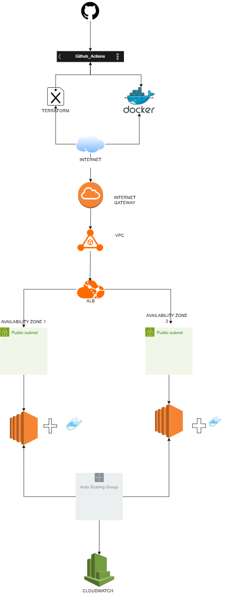

# AWS Cloud Engineer Assessment

## Project Overview

This project demonstrates a production-like cloud infrastructure deployment for a Dockerized web application on AWS using Terraform Infrastructure as Code (IaC). The architecture is designed with scalability, high availability, security, automation, and monitoring best practices.

The solution includes:

- Dockerized web application
- Terraform-managed AWS infrastructure
- Application Load Balancer (ALB)
- Auto Scaling Group (ASG)
- Multi-Availability Zone deployment
- CI/CD automation using GitHub Actions
- AWS CloudWatch monitoring

---

# Architecture Diagram



---

# Technologies Used

| Technology | Purpose |
|---|---|
| AWS EC2 | Compute instances |
| AWS VPC | Network isolation |
| AWS ALB | Traffic distribution |
| AWS Auto Scaling | High availability and scaling |
| Terraform | Infrastructure as Code |
| Docker | Application containerization |
| GitHub Actions | CI/CD pipeline |
| CloudWatch | Monitoring and metrics |

---

# Infrastructure Components

## Networking

- Custom VPC
- Internet Gateway
- Public subnets across multiple Availability Zones
- Route tables and associations
- Security groups

## Compute

- EC2 instances running Docker containers
- Launch Template
- Auto Scaling Group

## Load Balancing

- Application Load Balancer (ALB)
- Target Groups
- Health Checks

## Monitoring

- AWS CloudWatch metrics
- EC2 monitoring
- ALB monitoring
- Auto Scaling monitoring

## CI/CD

- Automated GitHub Actions workflow
- Docker image build and push
- Terraform validation and planning

---

# Architecture Design

## High Availability

The application is deployed across multiple Availability Zones to ensure fault tolerance and service availability during infrastructure failures.

## Scalability

An Auto Scaling Group dynamically manages EC2 instances based on infrastructure demand.

## Security

- Security Groups restrict unnecessary inbound traffic
- ALB handles public traffic
- EC2 instances are protected behind the load balancer
- Sensitive files such as `.pem`, `.tfstate`, and `terraform.tfvars` are excluded from version control

## Infrastructure as Code

Terraform is used to provision and manage all AWS infrastructure resources consistently and reproducibly.

---

# CI/CD Pipeline

GitHub Actions is used to automate deployment workflows.

## Pipeline Stages

```text
Code Push
   ↓
GitHub Actions
   ↓
Docker Image Build
   ↓
Docker Image Push
   ↓
Terraform Init
   ↓
Terraform Validate
   ↓
Terraform Plan
```

The pipeline validates infrastructure changes before deployment to prevent unintended modifications.

---

# Monitoring Implementation

Basic monitoring is implemented using AWS CloudWatch.

## Metrics Monitored

- EC2 CPU utilization
- Network traffic
- ALB request count
- ALB target health
- Auto Scaling Group health

CloudWatch dashboards and metrics provide operational visibility into infrastructure health and application availability.

---

# Repository Structure

```text
aws-cloud-engineer-assessment/
│
├── .github/
│   └── workflows/
│       └── deploy.yml
│
├── app/
│   ├── Dockerfile
│   └── index.html
│
├── terraform/
│   ├── main.tf
│   ├── provider.tf
│   ├── variables.tf
│   ├── outputs.tf
│   └── userdata.sh
│
├── architecture-diagram.png
├── README.md
└── .gitignore
```

---

# Deployment Instructions

## Prerequisites

Install the following tools:

- AWS CLI
- Terraform
- Docker
- Git

Configure AWS credentials:

```bash
aws configure
```

---

# Terraform Deployment

Navigate to Terraform directory:

```bash
cd terraform
```

Initialize Terraform:

```bash
terraform init
```

Validate Terraform configuration:

```bash
terraform validate
```

Preview infrastructure changes:

```bash
terraform plan
```

Deploy infrastructure:

```bash
terraform apply
```

---

# Docker Deployment

Build Docker image:

```bash
docker build -t cloud-app .
```

Run container locally:

```bash
docker run -p 80:80 cloud-app
```

---

# Cost Optimization

The following cost optimization strategies were considered:

- Usage of Free Tier eligible EC2 instances (`t2.micro`)
- Auto Scaling prevents over-provisioning
- Lightweight Dockerized application
- Infrastructure automation reduces operational overhead
- Native AWS monitoring services used instead of third-party tools

---

# Trade-Offs Considered

| Decision | Trade-Off |
|---|---|
| Public subnet deployment for EC2 | Simplified implementation for assessment |
| GitHub Actions pipeline stops at Terraform Plan | Prevents unintended infrastructure changes |
| Native CloudWatch monitoring | Simpler and cost-effective monitoring solution |

---

# Future Improvements

Potential enhancements include:

- Private subnet deployment for EC2 instances
- Remote Terraform backend using S3 and DynamoDB
- HTTPS with ACM certificates
- Blue/Green deployment strategy
- AWS WAF integration
- Container orchestration using Amazon EKS
- Centralized logging solution

---

# Security Best Practices

- Infrastructure managed using Terraform
- Sensitive files excluded using `.gitignore`
- Least privilege security group access
- CI/CD secrets stored securely in GitHub Secrets
- Docker containerization improves workload isolation

---

# Conclusion

This project demonstrates a scalable and production-oriented AWS cloud infrastructure using modern DevOps practices including Infrastructure as Code, CI/CD automation, containerization, load balancing, auto scaling, and monitoring.
